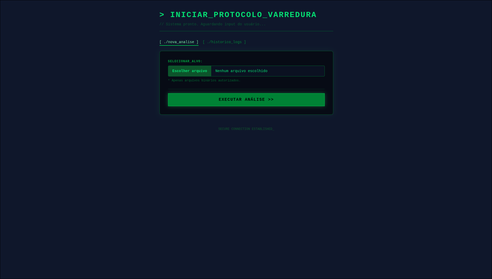

# 🔎 Analisador de Arquivos com Ruby on Rails 8

Este é um projeto desenvolvido com **Ruby on Rails 8** para demonstrar o processamento de arquivos, a integração com API externa (VirusTotal) e o armazenamento de dados em PostgreSQL.

O sistema calcula o hash de um arquivo enviado, verifica se ele é malicioso consultando a API do VirusTotal e armazena o resultado para evitar consultas repetidas (cache).



## Funcionalidades

- **Upload de Arquivos:** Interface simples para envio de arquivos.
- **Cálculo de Hash:** Computa o SHA-256 do arquivo para identificação única.
- **Integração com VirusTotal:** Verifica a segurança do arquivo via API.
- **Cache de Análise:** Salva os resultados no banco de dados para economizar requisições à API.
- **Histórico:** Exibe a lista de arquivos já analisados.
- **Configuração via .env:** Gerenciamento seguro de credenciais e variáveis de ambiente.

## Pré-requisitos

Certifique-se de ter instalado em sua máquina:

- **Ruby** (Versão 3.2 ou superior)
- **Rails** (Versão 8.0.3)
- **PostgreSQL** (Banco de dados)
- **Bundler**
- Uma chave de API do **VirusTotal** (Grátis).

## 🚀 Instalação e Configuração

### 1. Clone o repositório

```bash
git clone [URL_DO_SEU_REPOSITORIO]
cd analisador_rails

```

### 2. Instale as dependências

```bash
bundle install

```

### 3. Configuração de Variáveis de Ambiente (.env)

Este projeto utiliza a gem `dotenv-rails` para gerenciar senhas e chaves.

1. Crie um arquivo chamado `.env` na raiz do projeto.
2. Adicione o seguinte conteúdo, ajustando sua chave da API:

```env
# Configuração do Banco de Dados (Padrão local)
DB_USERNAME=postgres
DB_PASSWORD=postgres
DB_HOST=localhost

# Chave da API do VirusTotal
VIRUS_TOTAL_API_KEY=SUA_CHAVE_AQUI_123456

```

### 4. Configurar o Banco de Dados

Com o `.env` criado e o serviço do PostgreSQL rodando, execute:

```bash
rails db:create
rails db:migrate

```

### 5. Rodar o servidor

```bash
foreman start -f Procfile.dev

```

Acesse em seu navegador: `http://localhost:5000`

---

## 💻 Dicas para VS Code

Para garantir que o **Ruby LSP** (Intellisense/Autocomplete) funcione corretamente e não apresente erros de versão:

1. O projeto possui um arquivo `.ruby-version` definindo a versão exata do Ruby.
2. **Sempre abra o VS Code pelo terminal** para carregar corretamente o ambiente:
```bash
cd analisador_rails
code .

```


3. Utilize a extensão oficial **Ruby LSP** (Shopify).

## Estrutura do Projeto

* **`app/controllers/analyses_controller.rb`**: Gerencia o fluxo de upload e resposta.
* **`app/services/virus_total_client.rb`**: Encapsula a lógica de conexão com a API externa.
* **`app/models/analysis.rb`**: Modelo que representa a tabela de análises no banco.
* **`config/database.yml`**: Configurado para ler as variáveis do arquivo `.env`.

## Licença

Este projeto está licenciado sob a Licença MIT - veja o arquivo [`LICENSE`](LICENSE) para mais detalhes.
